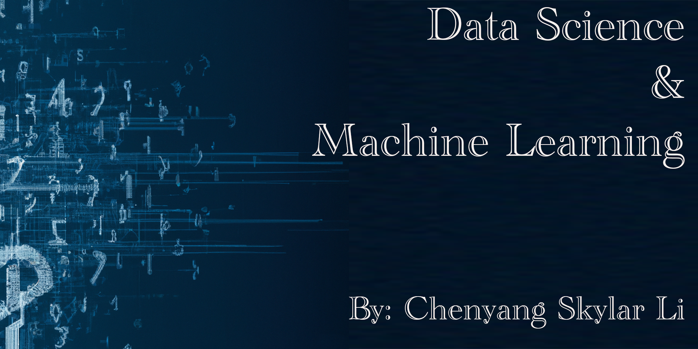

# Course: 

**INDE-577**: Data Science and Machine Learning (Rice University)

**Instructor**: Dr. Randy Davila

**Course Description**: 

This data science course covers algorithms from supervised learning, unsupervised learning, and reinforcement learning. We will implement many of the machine learning algorithms from scratch in python, but will also make use of, Scikit-Learn, Keras, and Tensorflow. ChatGPT is also a special focus of this semester.
**Textbook**:

* (Required) Hands-On Machine Learning with Scikit-Learn, Keras, and TensorFlow, 2nd Edition, by Aurélien Géron
* (Recommended Supplemental Reading) Machine Learning with Python for Everyone, Addison Wesley Data & Analytics Series, 2020 Pearson Education, by Mark E. Fenner

# Introduction to Data Science and Machine Learning repository

This repository constains all projects created in the course INDE-577, which provides **Data Science and Machine Learning** concepts, techniques and hands-on experiences. The purpose of this document is to provide a brief introduction to data science and machine learning and an overview of the content included in this repository.

## Table of Contents

- [What is Data Science?](#what-is-data-science)
- [What is Machine Learning?](#what-is-machine-learning)
- [Why is Data Science and Machine Learning Important?](#why-is-data-science-and-machine-learning-important)
- [Repository Content](#repository-content)
- [Contributing](#contributing)
- [LICENSE](#license)

## What is Data Science?

Data Science is a field that involves the collection, analysis, and interpretation of data. It combines elements of `statistics`, `computer science`, and `domain expertise` to extract insights and knowledge from data. Data scientists use a variety of tools and techniques to work with data, including programming languages, data visualization tools, and machine learning algorithms.

## What is Machine Learning?

Machine Learning is a subfield of Artificial Intelligence that involves building algorithms that can learn from data. These algorithms are designed to **automatically** improve their performance on a specific task through experience. Machine Learning can be used for a wide range of applications, including image recognition, natural language processing, and predictive analytics.

## Why is Data Science and Machine Learning Important?

Data Science and Machine Learning are becoming increasingly important as organizations seek to leverage the value of their data. By analyzing and interpreting data, businesses can gain insights that help them make better decisions, improve operations, and create new products and services. Machine Learning is particularly valuable because it can enable organizations to automate processes and make predictions that were previously difficult or impossible to make.

## Repository Content

This repository contains the following folders:
- [**assets**](./assets): Contains images and other assets used in this README and jupyter notebook file.
- [**data**](./data): Contains data and description used in this repository.
- [**algorithms**](./algorithms): Contains detailed description and implementation of machine learning algorithms.
- [**practice**](./practice): Contains projects and practices of data science and machine learning.
- 
## Contributing

This repository is open to contributions from the community. I will also keep it updated with my learning and practices. 

## LICENSE

This repository is licensed under the GPL-3 License. See [LICENSE](./LICENSE) for more information.

# Resources
### Programming Languages
- [Python](https://www.python.org/)
- [R](https://www.r-project.org/)
- [Julia](https://julialang.org/)
### Integrated Development Environments (IDEs)
- [Jupyter Notebook](https://jupyter.org/)
- [Visual Studio Code](https://code.visualstudio.com/)
- [PyCharm](https://www.jetbrains.com/pycharm/)
- [RStudio](https://rstudio.com/)
- [Julia](https://julialang.org/)
### Version Control
- [Github](https://github.com/)
### Data Visualization
- [Matplotlib](https://matplotlib.org/)
- [Seaborn](https://seaborn.pydata.org/)
- [Plotly](https://plotly.com/)
- [ggplot2](https://ggplot2.tidyverse.org/)
- [Shiny](https://shiny.rstudio.com/)
### Machine Learning
- [Scikit-Learn](https://scikit-learn.org/stable/)
- [Tensorflow](https://www.tensorflow.org/)
- [Keras](https://keras.io/)
- [PyTorch](https://pytorch.org/)
### Learning Resources
- [Kaggle](https://www.kaggle.com/)
- [TowardsDataScience](https://towardsdatascience.com/)
### Environments
- [Anaconda](https://www.anaconda.com/)
- [Google Colab](https://colab.research.google.com/notebooks/intro.ipynb#recent=true)
- [Python venv](https://docs.python.org/3/library/venv.html)
### Cloud Computing
- [Amazon Web Services](https://aws.amazon.com/)
- [Google Cloud Platform](https://cloud.google.com/)
- [Microsoft Azure](https://azure.microsoft.com/en-us/)
