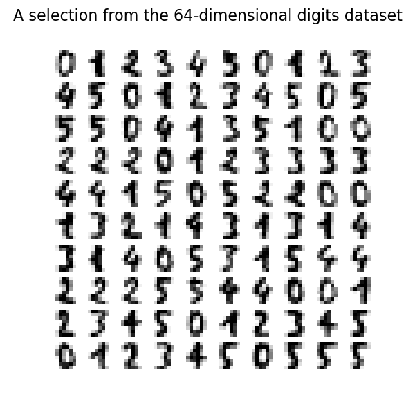

# Digits 

The Digits dataset is made up of 1,797 8x8 images of hand-written digits, useful for teaching image classification techniques.

This folder contains the following files:
- Data
    - [X](./X.npy): The features in `.npy` format.
    - [y](./y.npy): The target in `.npy` format.
- [Data Description](./digits.ipynb): A Jupyter notebook providing comprehensive details about the background, creation process, and distinct characteristics of the data.